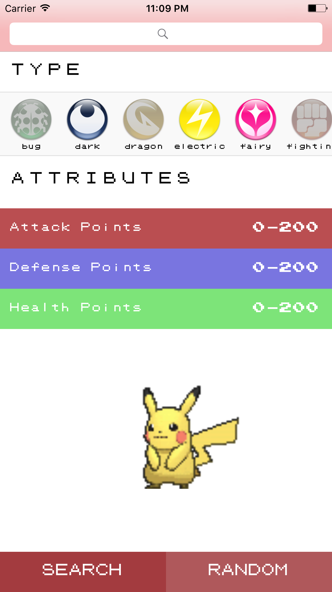

# Pokedex

Mini-project created during Mobile Developers of Berkeley's bootcamp that includes information for all first-generation Pokemon.

## Key Technologies Used
* Table Views
* Collection Views
* Pokemon API

